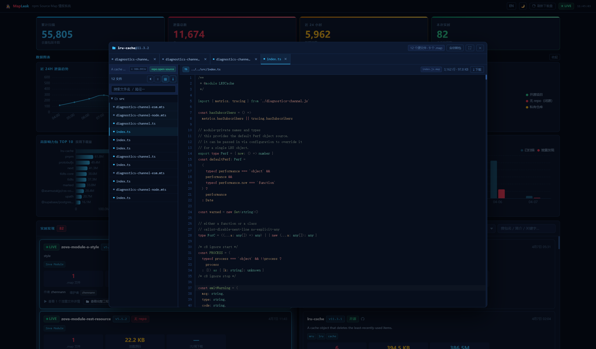

# 🕵️ MapLeak — npm Source Map 情报局 / Intelligence Bureau

<div align="center">

[🇨🇳 中文](#-中文) · [🇺🇸 English](#-english)

🌐 **在线演示 / Live Demo**：[https://mapleak.xsbcme.cn](https://mapleak.xsbcme.cn/)

</div>

---

## 🇨🇳 中文

> 因为有些工程师发包之前忘了删 `.map` 文件，所以我们写了这个工具来……欣赏他们的作品。

### 起源：一个价值连城的「手滑」

2025 年，Anthropic 的工程师在发布 **Claude Code 2.1.88** 时，打包工具 Bun 默默生成了一个 **59.8 MB 的 `cli.js.map`**，然后这个文件就这么光明正大地躺进了公开的 npm 仓库。

Source Map 是什么？简单说——它是一张「源码翻译对照表」，里面存着：

- 📁 所有源文件的**完整路径**
- 📄 每个文件的**完整源码内容**

本来只该活在开发环境里的东西，就这样以 59.8 MB 的体重，免费向全世界派发了。

安全研究员 Chaofan Shou 第一个发现并发到了 X 上。几小时内 GitHub 就冒出了好几个镜像仓库，其中一个不到 1 天就快 **10 万 Star**——当然，源码早被人转存得到处都是了。

Anthropic：「我们……我们是故意的，叫做开源。」（不是）

### 这个项目是什么？

**MapLeak** 是一个**全自动 npm Source Map 泄露监控系统**。

它会 24 小时不间断地盯着 npm 仓库的实时更新流，对每个新发布的包扒下来仔细嗅一嗅：

> 嘿，你的 tarball 里是不是夹带了 `.map` 文件？

一旦发现，立刻记录在案、实时推送到 Dashboard，让你第一时间得知——又有哪位工程师今晚要加班了。

### 功能特性

<div align="center">
  
  <br/><br/>
  
</div>

| 功能                  | 说明                                                                                 |
| --------------------- | ------------------------------------------------------------------------------------ |
| 🔄 **实时监控**       | 订阅 npm CouchDB Changes Feed，增量追踪新发布包                                      |
| 🔍 **自动扫描**       | 下载 tarball，精准定位 `.map` 文件，找到即停（不浪费流量）                           |
| 🌟 **热门包优先**     | 周下载量越高越先扫，影响力大的泄露不漏掉                                             |
| 📊 **实时 Dashboard** | Vue 3 单页应用，SSE 推流，泄露记录秒级到达屏幕                                       |
| 🔎 **全文搜索**       | 按包名 / 简介 / 关键字搜索历史记录                                                   |
| 🏷️ **包元数据展示**   | 自动抓取包简介、关键字、作者、维护者、npm 链接、仓库链接                             |
| 📖 **源码在线查看**   | 直接在浏览器里浏览泄露的源码文件树，支持语法高亮；工程视图可一键切换「含依赖包」模式 |
| 📄 **README 预览**    | 在源码查看器内直接渲染包的 README.md                                                 |
| ☁️ **云存储引用检测** | 顺手检测 `.map` 里有没有 Cloudflare R2 / S3 公开地址                                 |
| 📈 **统计图表**       | 趋势图、仓库类型分布、高影响力 TOP 10、泄露体积排行，实时联动刷新                    |
| ⬇️ **排序筛选**       | 历史记录支持按发现时间 / 周下载量排序，按仓库类型筛选                                |
| 🔁 **下载量补刷**     | 一键后台补刷所有历史记录的周下载量，实时显示进度                                     |

### 技术栈

```
后端                          前端
─────────────────────────    ──────────────────────────────
Node.js (ESM)                Vue 3.5 + Composition API
Fastify 4                    Tailwind CSS 4
SQLite (WAL 模式)             Apache ECharts 5
node-cron 定时任务            Shiki 语法高亮
tar-stream 流式解包           Vite 6
                             marked（README 渲染）
```

### 快速开始

**环境要求**：Node.js ≥ 18、pnpm

```bash
# 安装依赖
pnpm map-leak:install

# 启动后端（端口 3001）
pnpm map-leak:server

# 启动前端（端口 5173）
pnpm map-leak:web
```

打开 [http://localhost:5173](http://localhost:5173)，等待扫描结果滚滚而来。

> **提示**：首次运行后可点击顶栏的"刷新下载量"按钮，为已有历史记录补充周下载量数据。

### API 端点

| 端点                                | 说明                                                                               |
| ----------------------------------- | ---------------------------------------------------------------------------------- |
| `GET /api/findings`                 | 分页查询泄露记录（支持搜索、筛选、排序）                                           |
| `GET /api/findings/:id`             | 单条记录详情                                                                       |
| `GET /api/stats`                    | 统计汇总                                                                           |
| `GET /api/events`                   | SSE 实时推送                                                                       |
| `GET /api/charts/*`                 | 各类图表数据                                                                       |
| `GET /api/extract/:id`              | 提取单个 `.map` 的源码文件（含 README）                                            |
| `GET /api/extract-package`          | 工程视图：一次提取整包所有 `.map` 源码；`?include_node_modules=1` 可包含依赖包泄露 |
| `POST /api/admin/refresh-downloads` | 后台补刷所有包的周下载量                                                           |
| `GET /api/admin/refresh-downloads`  | 查询补刷进度                                                                       |

所有接口统一返回 `{ code: 200, msg: "", data: {} }` 格式。

### 工作原理

```
npm CouchDB Changes Feed
        │
        ▼  (每 30 分钟拉取增量，同时扫热门 TOP 500)
   包名列表 + 版本信息
        │
        ▼  (批量拉取下载量，50 个/次，按优先级排序)
   优先级排序（下载量 × 闭源系数）
        │
        ▼  (并发 5 个 Worker)
   下载 tarball (tar.gz)
        │
        ▼  (流式解包，找到 .map 即中止)
   发现 .map 文件？
    ├─ 否 → 标记已扫描，下一个
    └─ 是 → 解析文件路径/大小/云引用
              │
              ▼
         写入 SQLite（含包简介、关键字、下载量等元数据）
              │
              ▼
         SSE 推送前端 → Dashboard 实时更新 → 图表联动刷新
```

### PM2 部署（Linux / 宝塔面板）

**前置要求**：Node.js ≥ 18、npm（PM2 会自动安装）

适用于有 Linux 服务器、不想引入 Docker 的场景。前后端合一，Fastify 直接托管前端静态文件，无需单独的 Web 服务器。

**第一步：本地打包**

```bash
pnpm map-leak:pm2:pack
```

该命令会自动构建前端，并将以下内容整合到 `deploy/pm2/` 目录：

```
deploy/pm2/
├── src/                 ← 后端源码
├── public/              ← 前端编译产物（Fastify 直接托管）
├── package.json         ← 仅含生产依赖
├── ecosystem.config.cjs ← PM2 配置
├── .env.example         ← 环境变量示例
└── start.sh             ← 一键启动脚本
```

**第二步：上传到服务器**

将整个 `deploy/pm2/` 目录上传至服务器任意位置（如 `/opt/map-leak/`）。

**第三步：一键启动**

```bash
bash start.sh        # 默认端口 3001
bash start.sh 8080   # 指定端口
```

脚本会自动完成依赖安装、PM2 安装、服务启动与开机自启配置。完成后访问 `http://<服务器IP>:3001`。

**常用命令**：

```bash
pm2 logs map-leak      # 实时日志
pm2 restart map-leak   # 重启服务
pm2 stop map-leak      # 停止服务
pm2 status             # 查看进程状态
```

**环境变量**（修改 `ecosystem.config.cjs` 中的 `env` 字段，或参考 `.env.example`）：

| 变量                | 默认值         | 说明                                                                     |
| ------------------- | -------------- | ------------------------------------------------------------------------ |
| `API_PORT`          | `3001`         | 监听端口                                                                 |
| `CONCURRENCY`       | `5`            | 并发扫描 Worker 数量                                                     |
| `SCAN_INTERVAL`     | `*/30 * * * *` | cron 表达式，扫描频率                                                    |
| `SCAN_NODE_MODULES` | 空（关闭）     | 设为 `1` 时扫描 tarball 内 `node_modules/` 下的 `.map`（第三方依赖泄露）|
| `WEBHOOK_URL`       | 空             | 新泄露发现时 POST 通知地址（可选）                                       |
| `DB_PATH`           | 空（工作目录） | 自定义 SQLite 数据库路径（如 `/data/mapleak/data.db`）                   |

---

### Docker 一键部署

**前置要求**：Docker ≥ 20、Docker Compose v2

```bash
# 1. 克隆仓库
git clone <repo-url> && cd map-leak

# 2. 复制配置文件
cp deploy/docker/.env.example deploy/docker/.env
# 按需编辑 deploy/docker/.env 中的端口、并发数、Webhook 等

# 3. 一键启动（构建镜像 + 后台运行）
bash deploy/docker/deploy.sh
```

部署完成后控制台会输出访问地址，默认为 [http://localhost:3001](http://localhost:3001)（前后端合一，无需单独启动前端）。

**常用命令**：

```bash
pnpm map-leak:docker:deploy   # 等同于 docker compose -f deploy/docker/docker-compose.yml up -d --build
pnpm map-leak:docker:logs     # 查看实时日志
docker compose -f deploy/docker/docker-compose.yml down    # 停止并移除容器（数据卷保留）
```

**环境变量说明**：

| 变量                | 默认值         | 说明                                                                     |
| ------------------- | -------------- | ------------------------------------------------------------------------ |
| `API_PORT`          | `3001`         | 宿主机映射端口                                                           |
| `CONCURRENCY`       | `5`            | 并发扫描 Worker 数量                                                     |
| `SCAN_INTERVAL`     | `*/30 * * * *` | cron 表达式，扫描频率                                                    |
| `SCAN_NODE_MODULES` | 空（关闭）     | 设为 `1` 时扫描 tarball 内 `node_modules/` 下的 `.map`（第三方依赖泄露） |
| `WEBHOOK_URL`       | 空             | 新泄露发现时 POST 通知地址（可选）                                       |

> **数据持久化**：SQLite 数据库挂载到 Docker 卷 `map-leak-data`，容器重建后数据不丢失。

### 免责声明

本项目**仅用于安全研究与教育目的**。

我们不存储、不分发任何泄露的源码内容，只记录「哪个包、哪个版本、泄露了多少字节」这类元数据。

如果你在这里发现了自己公司的包——

> 🌹 恭喜你，这是一次免费的安全审计。请立刻重新发布一个不含 `.map` 的版本，然后去和你们的 CI/CD 工程师谈谈人生。

### 致所有忘记删 `.map` 文件的工程师

你们不是一个人。Claude Code 都翻车过，你怕什么？加油。🫡

---

## 🇺🇸 English

> Because some engineers forget to remove `.map` files before publishing, we built this tool to... appreciate their work.

### Origin: A Billion-Dollar Slip of the Finger

In 2025, when Anthropic engineers released **Claude Code 2.1.88**, their bundler Bun quietly generated a **59.8 MB `cli.js.map`** file — which then marched straight into the public npm registry without a care in the world.

What is a Source Map? Simply put — it's a "reverse translation table" containing:

- 📁 The **full paths** of every source file
- 📄 The **complete source code** of every file

Something that was only supposed to exist in development environments just shipped itself to the entire internet at 59.8 MB.

Security researcher Chaofan Shou spotted it first and posted to X. Within hours, GitHub was flooded with mirror repositories — one of them hit nearly **100k Stars in under a day**. By then, of course, the source code had already been scattered to the four winds.

Anthropic: "We... we meant to do that. It's called open source." (It wasn't.)

### What Is This Project?

**MapLeak** is a **fully automated npm Source Map leak monitoring system**.

It watches npm's real-time update stream 24/7, sniffing every newly published package:

> Hey — did you accidentally ship a `.map` file in your tarball?

The moment one is found, it's logged, pushed to the Dashboard in real time, and you'll know exactly which engineer is having a rough night.

### Features

| Feature                        | Description                                                                                                                                           |
| ------------------------------ | ----------------------------------------------------------------------------------------------------------------------------------------------------- |
| 🔄 **Real-time Monitoring**    | Subscribes to npm's CouchDB Changes Feed for incremental tracking                                                                                     |
| 🔍 **Auto Scanning**           | Downloads tarballs, pinpoints `.map` files, aborts immediately on find (no wasted bandwidth)                                                          |
| 🌟 **Popular Packages First**  | Higher weekly downloads = higher scan priority. High-impact leaks don't slip through                                                                  |
| 📊 **Live Dashboard**          | Vue 3 SPA with SSE streaming — leaks appear on screen within seconds                                                                                  |
| 🔎 **Full-text Search**        | Search history by package name, description, or keywords                                                                                              |
| 🏷️ **Package Metadata**        | Auto-fetches description, keywords, author, maintainers, npm & repo links                                                                             |
| 📖 **Inline Source Viewer**    | Browse leaked source file trees directly in the browser with syntax highlighting; project view includes a toggle to show third-party dependency leaks |
| 📄 **README Preview**          | Render the package's README.md inside the source viewer                                                                                               |
| ☁️ **Cloud Storage Detection** | Flags `.map` files referencing public Cloudflare R2 / S3 buckets                                                                                      |
| 📈 **Charts & Stats**          | Timeline trends, repo type breakdown, TOP 10 by downloads and leak size — live-refreshed on new events                                                |
| ⬇️ **Sort & Filter**           | Sort history by discovery time or weekly downloads; filter by repo type                                                                               |
| 🔁 **Download Count Refresh**  | One-click background refresh of weekly downloads for all historical records with live progress                                                        |

### Tech Stack

```
Backend                       Frontend
─────────────────────────    ──────────────────────────────
Node.js (ESM)                Vue 3.5 + Composition API
Fastify 4                    Tailwind CSS 4
SQLite (WAL mode)            Apache ECharts 5
node-cron scheduler          Shiki syntax highlighting
tar-stream streaming         Vite 6
                             marked (README rendering)
```

### Quick Start

**Requirements**: Node.js ≥ 18, pnpm

```bash
# Install dependencies
pnpm map-leak:install

# Start backend (port 3001)
pnpm map-leak:server

# Start frontend (port 5173)
pnpm map-leak:web
```

Open [http://localhost:5173](http://localhost:5173) and watch the findings roll in.

> **Tip**: After first run, click the "Refresh Downloads" button in the top bar to backfill weekly download counts for existing records.

### API Reference

| Endpoint                            | Description                                                                                                               |
| ----------------------------------- | ------------------------------------------------------------------------------------------------------------------------- |
| `GET /api/findings`                 | Paginated query with search, filter & sort                                                                                |
| `GET /api/findings/:id`             | Single record detail                                                                                                      |
| `GET /api/stats`                    | Aggregated statistics                                                                                                     |
| `GET /api/events`                   | SSE real-time stream                                                                                                      |
| `GET /api/charts/*`                 | Chart data endpoints                                                                                                      |
| `GET /api/extract/:id`              | Extract single `.map` source files (includes README)                                                                      |
| `GET /api/extract-package`          | Project view: extract all `.map` sources for a package at once; add `?include_node_modules=1` to include dependency leaks |
| `POST /api/admin/refresh-downloads` | Background refresh of weekly downloads                                                                                    |
| `GET /api/admin/refresh-downloads`  | Query refresh progress                                                                                                    |

All endpoints return `{ code: 200, msg: "", data: {} }`.

### How It Works

```
npm CouchDB Changes Feed
        │
        ▼  (pull increments every 30 min + scan TOP 500 popular)
   Package names + version info
        │
        ▼  (batch download counts, 50/req, sort by priority)
   Priority sort (downloads × closed-source multiplier)
        │
        ▼  (5 concurrent workers)
   Download tarball (tar.gz)
        │
        ▼  (stream-unpack, abort on first .map found)
   Found a .map file?
    ├─ No  → mark scanned, move on
    └─ Yes → parse file paths / sizes / cloud refs
              │
              ▼
         Write to SQLite (with description, keywords, downloads...)
              │
              ▼
         SSE push to frontend → Dashboard updates live → charts refresh
```

### PM2 Deployment (Linux / BT Panel)

**Requirements**: Node.js ≥ 18, npm (PM2 is installed automatically)

Ideal for Linux servers without Docker. Frontend static files are served directly by Fastify — no separate web server needed.

**Step 1: Build the deployment package locally**

```bash
pnpm map-leak:pm2:pack
```

This builds the frontend and assembles the following into `deploy/pm2/`:

```
deploy/pm2/
├── src/                 ← backend source code
├── public/              ← compiled frontend (served by Fastify)
├── package.json         ← production dependencies only
├── ecosystem.config.cjs ← PM2 configuration
├── .env.example         ← environment variable reference
└── start.sh             ← one-click launch script
```

**Step 2: Upload to server**

Upload the entire `deploy/pm2/` directory to any location on your server (e.g. `/opt/map-leak/`).

**Step 3: Launch**

```bash
bash start.sh        # default port 3001
bash start.sh 8080   # custom port
```

The script automatically installs dependencies, installs PM2 if needed, starts the service, and configures startup on boot. Once done, visit `http://<server-ip>:3001`.

**Useful commands**:

```bash
pm2 logs map-leak      # tail live logs
pm2 restart map-leak   # restart service
pm2 stop map-leak      # stop service
pm2 status             # check process status
```

**Environment variables** (edit the `env` block in `ecosystem.config.cjs`, or refer to `.env.example`):

| Variable            | Default        | Description                                                                                           |
| ------------------- | -------------- | ----------------------------------------------------------------------------------------------------- |
| `API_PORT`          | `3001`         | Listening port                                                                                        |
| `CONCURRENCY`       | `5`            | Concurrent scanner workers                                                                            |
| `SCAN_INTERVAL`     | `*/30 * * * *` | cron expression for scan frequency                                                                    |
| `SCAN_NODE_MODULES` | _(empty, off)_ | Set to `1` to scan `.map` files inside `node_modules/` within tarballs                               |
| `WEBHOOK_URL`       | _(empty)_      | POST notification URL on new leak (optional)                                                          |
| `DB_PATH`           | _(empty)_      | Custom SQLite path (e.g. `/data/mapleak/data.db`); defaults to working directory                      |

---

### One-Click Docker Deployment

**Requirements**: Docker ≥ 20, Docker Compose v2

```bash
# 1. Clone the repo
git clone <repo-url> && cd map-leak

# 2. Copy config
cp deploy/docker/.env.example deploy/docker/.env
# Edit deploy/docker/.env to customize port, concurrency, Webhook, etc.

# 3. Deploy (build image + start in background)
bash deploy/docker/deploy.sh
```

After deployment, the console prints the access URL. Default: [http://localhost:3001](http://localhost:3001) — frontend and backend served together, no separate frontend startup needed.

**Useful commands**:

```bash
pnpm map-leak:docker:deploy   # equivalent to docker compose -f deploy/docker/docker-compose.yml up -d --build
pnpm map-leak:docker:logs     # tail live logs
docker compose -f deploy/docker/docker-compose.yml down    # stop and remove containers (data volume preserved)
```

**Environment variables**:

| Variable            | Default        | Description                                                                                           |
| ------------------- | -------------- | ----------------------------------------------------------------------------------------------------- |
| `API_PORT`          | `3001`         | Host port mapping                                                                                     |
| `CONCURRENCY`       | `5`            | Concurrent scanner workers                                                                            |
| `SCAN_INTERVAL`     | `*/30 * * * *` | cron expression for scan frequency                                                                    |
| `SCAN_NODE_MODULES` | _(empty, off)_ | Set to `1` to scan `.map` files inside `node_modules/` within tarballs (third-party dependency leaks) |
| `WEBHOOK_URL`       | _(empty)_      | POST notification URL on new leak (optional)                                                          |

> **Data persistence**: SQLite is mounted to Docker volume `map-leak-data` — data survives container rebuilds.

### Disclaimer

This project is **for security research and educational purposes only**.

We do not store or distribute any leaked source code — only metadata such as "which package, which version, how many bytes were exposed."

If you find your own company's package in here —

> 🌹 Congratulations, you've just received a free security audit. Please republish a version without `.map` files, then go have a long talk with your CI/CD engineer about life choices.

### To Every Engineer Who Forgot to Delete Their `.map` Files

You're not alone. Even Claude Code shipped one. You've got this. 🫡
